# Diccionario de Datos y Esquema de Base de Datos - SIGEA Backend

> **Documento de Referencia Canónica para la Base de Datos PostgreSQL**  
> **Motor**: PostgreSQL 15+ / Neon Cloud  
> **Total Tablas**: 42  
> **Total Relaciones Foráneas**: 64  
> **Ubicación del DDL ejecutable**: [`docs/database/schema.sql`](file:///home/dfranco/Projects/demosigea-backend/docs/database/schema.sql) y [`src/main/resources/db/schema.sql`](file:///home/dfranco/Projects/demosigea-backend/src/main/resources/db/schema.sql)  
> **Catálogo JSON**: [`docs/database/schema.json`](file:///home/dfranco/Projects/demosigea-backend/docs/database/schema.json)

Este documento contiene la especificación completa, exhaustiva y estructurada de la base de datos de SIGEA (Sistema de Información para la Gestión de Eventos Académicos). Cualquier agente o desarrollador que cree o modifique entidades JPA, repositorios, DTOs, servicios, validaciones o migraciones **debe basarse rigurosamente en este documento**.

## Tabla de Contenidos por Módulos

### 1. Seguridad, Usuarios y Control de Acceso
- [`personas`](#personas) (`Persona`): Información básica y de contacto de personas naturales asociadas al sistema (asistentes, ponentes, evaluadores, organizadores).
- [`usuarios`](#usuarios) (`Usuario`): Cuentas de usuario para autenticación en la plataforma, vinculadas a un registro de persona.
- [`roles`](#roles) (`Rol`): Roles de seguridad del sistema para control de acceso basado en roles (RBAC).
- [`permisos`](#permisos) (`Permiso`): Permisos atómicos o privilegios funcionales asignables a roles.
- [`roles_permisos`](#roles_permisos) (`RolPermiso`): Tabla intermedia para relación muchos a muchos entre roles y permisos.
- [`usuarios_roles`](#usuarios_roles) (`UsuarioRol`): Asignación de roles a usuarios con registro de fecha.
- [`tokens_recuperacion`](#tokens_recuperacion) (`TokenRecuperacion`): Tokens temporales para verificación de correo electrónico o recuperación de credenciales.
- [`auditoria`](#auditoria) (`Auditoria`): Registro de eventos, trazabilidad y acciones críticas realizadas por los usuarios en el sistema.

### 2. Gestión de Eventos y Organización
- [`eventos`](#eventos) (`Evento`): Entidad principal que almacena los eventos académicos organizados por la institución.
- [`comite_organizador`](#comite_organizador) (`ComiteOrganizador`): Integrantes del comité organizador asignados a un evento específico con sus respectivos roles.
- [`tipos_actividad`](#tipos_actividad) (`TipoActividad`): Tipologías de actividades académicas configuradas para un evento (ej. Conferencia, Taller, Panel, Póster).
- [`lineas_tematicas`](#lineas_tematicas) (`LineaTematica`): Ejes temáticos o áreas disciplinares en las que se enmarcan las actividades y propuestas del evento.

### 3. Presupuesto y Finanzas
- [`rubros_presupuestales`](#rubros_presupuestales) (`RubroPresupuestal`): Proyección y planificación de rubros presupuestales estimados para la ejecución del evento.
- [`presupuestos_aprobados`](#presupuestos_aprobados) (`PresupuestoAprobado`): Registro formal de aprobación del presupuesto general asignado al evento con evidencia documental.
- [`gastos_ejecutados`](#gastos_ejecutados) (`GastoEjecutado`): Registro contable de gastos reales ejecutados con soporte contra rubros presupuestales.

### 4. Convocatorias, Ponentes y Propuestas
- [`convocatorias`](#convocatorias) (`Convocatoria`): Llamados públicos a presentación de propuestas académicas asociadas a un evento.
- [`participaciones_conferencista`](#participaciones_conferencista) (`ParticipacionConferencista`): Registro formal de conferencistas magistrales o ponentes invitados al evento.
- [`propuestas`](#propuestas) (`Propuesta`): Trabajos, ponencias o artículos académicos postulados por autores a una convocatoria.
- [`propuestas_autores`](#propuestas_autores) (`PropuestaAutor`): Autores y coautores vinculados a una propuesta académica con orden de autoría.
- [`versiones_propuesta`](#versiones_propuesta) (`VersionPropuesta`): Historial de versiones y archivos adjuntos (PDF/documentos) de una propuesta a lo largo del proceso de revisión.

### 5. Sistema de Evaluación por Pares
- [`rubricas_evaluacion`](#rubricas_evaluacion) (`RubricaEvaluacion`): Instrumentos o rúbricas de evaluación configuradas para calificar propuestas en una convocatoria.
- [`criterios_rubrica`](#criterios_rubrica) (`CriterioRubrica`): Criterios individuales de evaluación con sus respectivos pesos porcentuales.
- [`comites_evaluadores`](#comites_evaluadores) (`ComiteEvaluador`): Pares académicos o evaluadores designados para una convocatoria específica.
- [`asignaciones_evaluacion`](#asignaciones_evaluacion) (`AsignacionEvaluacion`): Asignación de una propuesta académica a un evaluador del comité.
- [`evaluaciones`](#evaluaciones) (`Evaluacion`): Calificaciones otorgadas por el evaluador a cada criterio de la rúbrica.
- [`resultados_evaluacion`](#resultados_evaluacion) (`ResultadoEvaluacion`): Consolidado final de evaluación de una propuesta con puntuación ponderada y clasificación final.
- [`observaciones_propuesta`](#observaciones_propuesta) (`ObservacionPropuesta`): Observaciones, correcciones y retroalimentación de evaluadores dirigidas a una versión de la propuesta.

### 6. Espacios Físicos, Virtuales y Disponibilidad
- [`salas`](#salas) (`Sala`): Espacios físicos (aulas, auditorios) o virtuales (plataformas de videoconferencia) asignados al evento.
- [`disponibilidad_salas`](#disponibilidad_salas) (`DisponibilidadSala`): Franjas horarias y fechas de disponibilidad programada para cada sala.
- [`disponibilidad_ponentes`](#disponibilidad_ponentes) (`DisponibilidadPonente`): Disponibilidad de horario reportada por ponentes para facilitar la programación de sus actividades.

### 7. Programación y Agenda del Evento
- [`actividades`](#actividades) (`Actividad`): Programación concreta de actividades dentro de la agenda del evento (horarios, salas, ponentes).
- [`agendas_publicadas`](#agendas_publicadas) (`AgendaPublicada`): Control de publicación y visibilidad de la programación diaria del evento hacia el público.

### 8. Inscripciones, Acreditación y Asistencia
- [`inscripciones_evento`](#inscripciones_evento) (`InscripcionEvento`): Registro de inscripción de participantes y asistentes a un evento según categoría.
- [`inscripciones_actividad`](#inscripciones_actividad) (`InscripcionActividad`): Inscripción específica de asistentes a actividades particulares con control de aforo.
- [`codigos_qr`](#codigos_qr) (`CodigoQr`): Códigos QR únicos generados para acreditación y control de acceso por inscripción.
- [`asistencias`](#asistencias) (`Asistencia`): Registro en tiempo real de asistencia a actividades o al evento mediante QR o registro manual.

### 9. Encuestas, Certificados, Métricas y Memorias
- [`encuestas`](#encuestas) (`Encuesta`): Instrumentos de retroalimentación y encuestas de satisfacción para eventos o actividades.
- [`preguntas_encuesta`](#preguntas_encuesta) (`PreguntaEncuesta`): Preguntas individuales configuradas dentro de una encuesta.
- [`respuestas_encuesta`](#respuestas_encuesta) (`RespuestaEncuesta`): Respuestas recopiladas de los participantes a las preguntas de una encuesta.
- [`certificados`](#certificados) (`Certificado`): Certificados digitales generados para participantes, ponentes, evaluadores y organizadores.
- [`indicadores`](#indicadores) (`Indicador`): Métricas, indicadores de gestión y KPIs calculados para evaluar el éxito del evento.
- [`memorias_historicas`](#memorias_historicas) (`MemoriaHistorica`): Consolidación final de memorias, relatorías y documentos históricos del evento cerrado.

--------------------------------------------------------------------------------

## Reglas de Mapeo a Java 21 / Spring Data JPA

| Tipo PostgreSQL | Tipo Java / Jakarta JPA | Anotaciones Recomendadas |
| :--- | :--- | :--- |
| `SERIAL PRIMARY KEY` | `Long` | `@Id @GeneratedValue(strategy = GenerationType.IDENTITY)` |
| `INT` / `INTEGER` | `Integer` | `@Column(nullable = ...)` |
| `VARCHAR(n)` | `String` | `@Column(length = n, nullable = ...)` |
| `TEXT` | `String` | `@Column(columnDefinition = "TEXT")` |
| `NUMERIC(p,s)` | `java.math.BigDecimal` | `@Column(precision = p, scale = s)` |
| `BOOLEAN` | `Boolean` | `@Column(nullable = false)` |
| `DATE` | `java.time.LocalDate` | `@Column(nullable = ...)` |
| `TIME` | `java.time.LocalTime` | `@Column(nullable = ...)` |
| `TIMESTAMP` | `java.time.LocalDateTime` | `@Column(nullable = ...)` |
| Claves Foráneas (FK) | Entidad relacionada | `@ManyToOne(fetch = FetchType.LAZY) @JoinColumn(name = "...")` |

--------------------------------------------------------------------------------

## Catálogo Detallado de Tablas

## 1. Seguridad, Usuarios y Control de Acceso

### `personas`

**Descripción**: Información básica y de contacto de personas naturales asociadas al sistema (asistentes, ponentes, evaluadores, organizadores).  
**Entidad JPA Recomendada**: `com.sigea.demosigea_backend.model.Persona` (anotada con `@Entity @Table(name = "personas")`)  
**Clave Primaria**: `persona_id`

| Columna | Tipo SQL | Tipo Java | Nulo | Clave | Default | Restricciones / Referencias |
| :--- | :--- | :--- | :---: | :---: | :--- | :--- |
| `persona_id` | `SERIAL` | `Long (o Integer)` | NO | PK | - | - |
| `tipo_documento` | `VARCHAR(20)` | `String` | NO |  | - | - |
| `numero_documento` | `VARCHAR(30)` | `String` | NO |  | - | **UNIQUE** |
| `nombres` | `VARCHAR(100)` | `String` | NO |  | - | - |
| `apellidos` | `VARCHAR(100)` | `String` | NO |  | - | - |
| `correo` | `VARCHAR(150)` | `String` | NO |  | - | **UNIQUE** |
| `telefono` | `VARCHAR(30)` | `String` | SÍ |  | - | - |
| `afiliacion_institucional` | `VARCHAR(150)` | `String` | SÍ |  | - | - |

---

### `usuarios`

**Descripción**: Cuentas de usuario para autenticación en la plataforma, vinculadas a un registro de persona.  
**Entidad JPA Recomendada**: `com.sigea.demosigea_backend.model.Usuario` (anotada con `@Entity @Table(name = "usuarios")`)  
**Clave Primaria**: `usuario_id`

| Columna | Tipo SQL | Tipo Java | Nulo | Clave | Default | Restricciones / Referencias |
| :--- | :--- | :--- | :---: | :---: | :--- | :--- |
| `usuario_id` | `SERIAL` | `Long (o Integer)` | NO | PK | - | - |
| `persona_id` | `INT` | `Integer` | NO | FK | - | **UNIQUE**, FK -> [`personas.persona_id`](#personas) |
| `nombre_usuario` | `VARCHAR(50)` | `String` | NO |  | - | **UNIQUE** |
| `contrasena_hash` | `VARCHAR(255)` | `String` | NO |  | - | - |
| `correo_verificado` | `BOOLEAN` | `Boolean` | NO |  | `false` | - |
| `estado` | `VARCHAR(20)` | `String` | NO |  | `'activo'` | CHECK `estado IN ('activo','bloqueado','inactivo'` |
| `fecha_registro` | `TIMESTAMP` | `LocalDateTime` | NO |  | `(CURRENT_TIMESTAMP)` | - |

**Relaciones Foráneas Salientes**:
- Columna `persona_id` -> [`personas.persona_id`](#personas) `DEFERRABLE INITIALLY IMMEDIATE`

---

### `roles`

**Descripción**: Roles de seguridad del sistema para control de acceso basado en roles (RBAC).  
**Entidad JPA Recomendada**: `com.sigea.demosigea_backend.model.Rol` (anotada con `@Entity @Table(name = "roles")`)  
**Clave Primaria**: `rol_id`

| Columna | Tipo SQL | Tipo Java | Nulo | Clave | Default | Restricciones / Referencias |
| :--- | :--- | :--- | :---: | :---: | :--- | :--- |
| `rol_id` | `SERIAL` | `Long (o Integer)` | NO | PK | - | - |
| `nombre` | `VARCHAR(50)` | `String` | NO |  | - | **UNIQUE** |
| `descripcion` | `VARCHAR(255)` | `String` | SÍ |  | - | - |

---

### `permisos`

**Descripción**: Permisos atómicos o privilegios funcionales asignables a roles.  
**Entidad JPA Recomendada**: `com.sigea.demosigea_backend.model.Permiso` (anotada con `@Entity @Table(name = "permisos")`)  
**Clave Primaria**: `permiso_id`

| Columna | Tipo SQL | Tipo Java | Nulo | Clave | Default | Restricciones / Referencias |
| :--- | :--- | :--- | :---: | :---: | :--- | :--- |
| `permiso_id` | `SERIAL` | `Long (o Integer)` | NO | PK | - | - |
| `codigo` | `VARCHAR(50)` | `String` | NO |  | - | **UNIQUE** |
| `modulo` | `VARCHAR(50)` | `String` | NO |  | - | - |
| `descripcion` | `VARCHAR(255)` | `String` | SÍ |  | - | - |

---

### `roles_permisos`

**Descripción**: Tabla intermedia para relación muchos a muchos entre roles y permisos.  
**Entidad JPA Recomendada**: `com.sigea.demosigea_backend.model.RolPermiso` (anotada con `@Entity @Table(name = "roles_permisos")`)  
**Clave Primaria**: `rol_id, permiso_id`

| Columna | Tipo SQL | Tipo Java | Nulo | Clave | Default | Restricciones / Referencias |
| :--- | :--- | :--- | :---: | :---: | :--- | :--- |
| `rol_id` | `INT` | `Integer` | NO | PK | - | FK -> [`roles.rol_id`](#roles) |
| `permiso_id` | `INT` | `Integer` | NO | PK | - | FK -> [`permisos.permiso_id`](#permisos) |

**Relaciones Foráneas Salientes**:
- Columna `rol_id` -> [`roles.rol_id`](#roles) `ON DELETE CASCADE DEFERRABLE INITIALLY IMMEDIATE`
- Columna `permiso_id` -> [`permisos.permiso_id`](#permisos) `ON DELETE CASCADE DEFERRABLE INITIALLY IMMEDIATE`

---

### `usuarios_roles`

**Descripción**: Asignación de roles a usuarios con registro de fecha.  
**Entidad JPA Recomendada**: `com.sigea.demosigea_backend.model.UsuarioRol` (anotada con `@Entity @Table(name = "usuarios_roles")`)  
**Clave Primaria**: `usuario_id, rol_id`

| Columna | Tipo SQL | Tipo Java | Nulo | Clave | Default | Restricciones / Referencias |
| :--- | :--- | :--- | :---: | :---: | :--- | :--- |
| `usuario_id` | `INT` | `Integer` | NO | PK | - | FK -> [`usuarios.usuario_id`](#usuarios) |
| `rol_id` | `INT` | `Integer` | NO | PK | - | FK -> [`roles.rol_id`](#roles) |
| `fecha_asignacion` | `TIMESTAMP` | `LocalDateTime` | NO |  | `(CURRENT_TIMESTAMP)` | - |

**Relaciones Foráneas Salientes**:
- Columna `usuario_id` -> [`usuarios.usuario_id`](#usuarios) `ON DELETE CASCADE DEFERRABLE INITIALLY IMMEDIATE`
- Columna `rol_id` -> [`roles.rol_id`](#roles) `ON DELETE CASCADE DEFERRABLE INITIALLY IMMEDIATE`

---

### `tokens_recuperacion`

**Descripción**: Tokens temporales para verificación de correo electrónico o recuperación de credenciales.  
**Entidad JPA Recomendada**: `com.sigea.demosigea_backend.model.TokenRecuperacion` (anotada con `@Entity @Table(name = "tokens_recuperacion")`)  
**Clave Primaria**: `token_id`

| Columna | Tipo SQL | Tipo Java | Nulo | Clave | Default | Restricciones / Referencias |
| :--- | :--- | :--- | :---: | :---: | :--- | :--- |
| `token_id` | `SERIAL` | `Long (o Integer)` | NO | PK | - | - |
| `usuario_id` | `INT` | `Integer` | NO | FK | - | FK -> [`usuarios.usuario_id`](#usuarios) |
| `token` | `VARCHAR(255)` | `String` | NO |  | - | **UNIQUE** |
| `tipo` | `VARCHAR(20)` | `String` | NO |  | - | CHECK `tipo IN ('verificacion','recuperacion'` |
| `fecha_generacion` | `TIMESTAMP` | `LocalDateTime` | NO |  | `(CURRENT_TIMESTAMP)` | - |
| `fecha_expiracion` | `TIMESTAMP` | `LocalDateTime` | NO |  | - | - |
| `usado` | `BOOLEAN` | `Boolean` | NO |  | `false` | - |

**Relaciones Foráneas Salientes**:
- Columna `usuario_id` -> [`usuarios.usuario_id`](#usuarios) `ON DELETE CASCADE DEFERRABLE INITIALLY IMMEDIATE`

---

### `auditoria`

**Descripción**: Registro de eventos, trazabilidad y acciones críticas realizadas por los usuarios en el sistema.  
**Entidad JPA Recomendada**: `com.sigea.demosigea_backend.model.Auditoria` (anotada con `@Entity @Table(name = "auditoria")`)  
**Clave Primaria**: `auditoria_id`

| Columna | Tipo SQL | Tipo Java | Nulo | Clave | Default | Restricciones / Referencias |
| :--- | :--- | :--- | :---: | :---: | :--- | :--- |
| `auditoria_id` | `SERIAL` | `Long (o Integer)` | NO | PK | - | - |
| `usuario_id` | `INT` | `Integer` | SÍ | FK | - | FK -> [`usuarios.usuario_id`](#usuarios) |
| `accion` | `VARCHAR(100)` | `String` | NO |  | - | - |
| `entidad` | `VARCHAR(100)` | `String` | NO |  | - | - |
| `entidad_id` | `INT` | `Integer` | SÍ |  | - | - |
| `fecha_hora` | `TIMESTAMP` | `LocalDateTime` | NO |  | `(CURRENT_TIMESTAMP)` | - |
| `detalle` | `TEXT` | `String` | SÍ |  | - | - |

**Relaciones Foráneas Salientes**:
- Columna `usuario_id` -> [`usuarios.usuario_id`](#usuarios) `DEFERRABLE INITIALLY IMMEDIATE`

---

## 2. Gestión de Eventos y Organización

### `eventos`

**Descripción**: Entidad principal que almacena los eventos académicos organizados por la institución.  
**Entidad JPA Recomendada**: `com.sigea.demosigea_backend.model.Evento` (anotada con `@Entity @Table(name = "eventos")`)  
**Clave Primaria**: `evento_id`

| Columna | Tipo SQL | Tipo Java | Nulo | Clave | Default | Restricciones / Referencias |
| :--- | :--- | :--- | :---: | :---: | :--- | :--- |
| `evento_id` | `SERIAL` | `Long (o Integer)` | NO | PK | - | - |
| `nombre` | `VARCHAR(200)` | `String` | NO |  | - | - |
| `objetivo` | `TEXT` | `String` | SÍ |  | - | - |
| `descripcion` | `TEXT` | `String` | SÍ |  | - | - |
| `tipo` | `VARCHAR(50)` | `String` | SÍ |  | - | - |
| `modalidad` | `VARCHAR(20)` | `String` | SÍ |  | - | CHECK `modalidad IN ('presencial','virtual','hibrida'` |
| `fecha_inicio` | `DATE` | `LocalDate` | NO |  | - | - |
| `fecha_fin` | `DATE` | `LocalDate` | NO |  | - | - |
| `semestre` | `VARCHAR(10)` | `String` | SÍ |  | - | - |
| `estado` | `VARCHAR(30)` | `String` | NO |  | `'en_configuracion'` | CHECK `estado IN ('en_configuracion','habilitado','en_ejecucion','cerrado'` |
| `evento_base_id` | `INT` | `Integer` | SÍ | FK | - | FK -> [`eventos.evento_id`](#eventos) |

**Restricciones de Tabla (CHECK)**:
- `CHECK (fecha_fin >= fecha_inicio)`

**Índices Definidos**:
- Índice `idx_eventos_semestre` sobre (`semestre`)

**Relaciones Foráneas Salientes**:
- Columna `evento_base_id` -> [`eventos.evento_id`](#eventos) `DEFERRABLE INITIALLY IMMEDIATE`

---

### `comite_organizador`

**Descripción**: Integrantes del comité organizador asignados a un evento específico con sus respectivos roles.  
**Entidad JPA Recomendada**: `com.sigea.demosigea_backend.model.ComiteOrganizador` (anotada con `@Entity @Table(name = "comite_organizador")`)  
**Clave Primaria**: `comite_id`

| Columna | Tipo SQL | Tipo Java | Nulo | Clave | Default | Restricciones / Referencias |
| :--- | :--- | :--- | :---: | :---: | :--- | :--- |
| `comite_id` | `SERIAL` | `Long (o Integer)` | NO | PK | - | - |
| `evento_id` | `INT` | `Integer` | NO | FK | - | FK -> [`eventos.evento_id`](#eventos) |
| `persona_id` | `INT` | `Integer` | NO | FK | - | FK -> [`personas.persona_id`](#personas) |
| `rol_comite` | `VARCHAR(50)` | `String` | NO |  | - | - |
| `fecha_asignacion` | `TIMESTAMP` | `LocalDateTime` | NO |  | `(CURRENT_TIMESTAMP)` | - |
| `activo` | `BOOLEAN` | `Boolean` | NO |  | `true` | - |

**Índices Definidos**:
- UNIQUE Índice `comite_organizador_evento_id_persona_id_rol_comite_idx` sobre (`evento_id`, `persona_id`, `rol_comite`)

**Relaciones Foráneas Salientes**:
- Columna `evento_id` -> [`eventos.evento_id`](#eventos) `ON DELETE CASCADE DEFERRABLE INITIALLY IMMEDIATE`
- Columna `persona_id` -> [`personas.persona_id`](#personas) `DEFERRABLE INITIALLY IMMEDIATE`

---

### `tipos_actividad`

**Descripción**: Tipologías de actividades académicas configuradas para un evento (ej. Conferencia, Taller, Panel, Póster).  
**Entidad JPA Recomendada**: `com.sigea.demosigea_backend.model.TipoActividad` (anotada con `@Entity @Table(name = "tipos_actividad")`)  
**Clave Primaria**: `tipo_actividad_id`

| Columna | Tipo SQL | Tipo Java | Nulo | Clave | Default | Restricciones / Referencias |
| :--- | :--- | :--- | :---: | :---: | :--- | :--- |
| `tipo_actividad_id` | `SERIAL` | `Long (o Integer)` | NO | PK | - | - |
| `evento_id` | `INT` | `Integer` | NO | FK | - | FK -> [`eventos.evento_id`](#eventos) |
| `nombre` | `VARCHAR(80)` | `String` | NO |  | - | - |
| `descripcion` | `VARCHAR(255)` | `String` | SÍ |  | - | - |

**Índices Definidos**:
- UNIQUE Índice `tipos_actividad_evento_id_nombre_idx` sobre (`evento_id`, `nombre`)

**Relaciones Foráneas Salientes**:
- Columna `evento_id` -> [`eventos.evento_id`](#eventos) `ON DELETE CASCADE DEFERRABLE INITIALLY IMMEDIATE`

---

### `lineas_tematicas`

**Descripción**: Ejes temáticos o áreas disciplinares en las que se enmarcan las actividades y propuestas del evento.  
**Entidad JPA Recomendada**: `com.sigea.demosigea_backend.model.LineaTematica` (anotada con `@Entity @Table(name = "lineas_tematicas")`)  
**Clave Primaria**: `linea_tematica_id`

| Columna | Tipo SQL | Tipo Java | Nulo | Clave | Default | Restricciones / Referencias |
| :--- | :--- | :--- | :---: | :---: | :--- | :--- |
| `linea_tematica_id` | `SERIAL` | `Long (o Integer)` | NO | PK | - | - |
| `evento_id` | `INT` | `Integer` | NO | FK | - | FK -> [`eventos.evento_id`](#eventos) |
| `nombre` | `VARCHAR(120)` | `String` | NO |  | - | - |
| `descripcion` | `VARCHAR(255)` | `String` | SÍ |  | - | - |

**Índices Definidos**:
- UNIQUE Índice `lineas_tematicas_evento_id_nombre_idx` sobre (`evento_id`, `nombre`)

**Relaciones Foráneas Salientes**:
- Columna `evento_id` -> [`eventos.evento_id`](#eventos) `ON DELETE CASCADE DEFERRABLE INITIALLY IMMEDIATE`

---

## 3. Presupuesto y Finanzas

### `rubros_presupuestales`

**Descripción**: Proyección y planificación de rubros presupuestales estimados para la ejecución del evento.  
**Entidad JPA Recomendada**: `com.sigea.demosigea_backend.model.RubroPresupuestal` (anotada con `@Entity @Table(name = "rubros_presupuestales")`)  
**Clave Primaria**: `rubro_id`

| Columna | Tipo SQL | Tipo Java | Nulo | Clave | Default | Restricciones / Referencias |
| :--- | :--- | :--- | :---: | :---: | :--- | :--- |
| `rubro_id` | `SERIAL` | `Long (o Integer)` | NO | PK | - | - |
| `evento_id` | `INT` | `Integer` | NO | FK | - | FK -> [`eventos.evento_id`](#eventos) |
| `nombre` | `VARCHAR(100)` | `String` | NO |  | - | - |
| `cantidad` | `NUMERIC(10,2)` | `BigDecimal` | NO |  | - | CHECK `cantidad >= 0` |
| `valor_unitario_proyectado` | `NUMERIC(14,2)` | `BigDecimal` | NO |  | - | CHECK `valor_unitario_proyectado >= 0` |
| `activo` | `BOOLEAN` | `Boolean` | NO |  | `true` | - |

**Índices Definidos**:
- UNIQUE Índice `rubros_presupuestales_evento_id_nombre_idx` sobre (`evento_id`, `nombre`)

**Relaciones Foráneas Salientes**:
- Columna `evento_id` -> [`eventos.evento_id`](#eventos) `ON DELETE CASCADE DEFERRABLE INITIALLY IMMEDIATE`

---

### `presupuestos_aprobados`

**Descripción**: Registro formal de aprobación del presupuesto general asignado al evento con evidencia documental.  
**Entidad JPA Recomendada**: `com.sigea.demosigea_backend.model.PresupuestoAprobado` (anotada con `@Entity @Table(name = "presupuestos_aprobados")`)  
**Clave Primaria**: `aprobacion_id`

| Columna | Tipo SQL | Tipo Java | Nulo | Clave | Default | Restricciones / Referencias |
| :--- | :--- | :--- | :---: | :---: | :--- | :--- |
| `aprobacion_id` | `SERIAL` | `Long (o Integer)` | NO | PK | - | - |
| `evento_id` | `INT` | `Integer` | NO | FK | - | **UNIQUE**, FK -> [`eventos.evento_id`](#eventos) |
| `valor_total_aprobado` | `NUMERIC(14,2)` | `BigDecimal` | NO |  | - | CHECK `valor_total_aprobado >= 0` |
| `evidencia_url` | `VARCHAR(255)` | `String` | NO |  | - | - |
| `fecha_aprobacion` | `TIMESTAMP` | `LocalDateTime` | NO |  | `(CURRENT_TIMESTAMP)` | - |
| `aprobado_por` | `INT` | `Integer` | NO | FK | - | FK -> [`usuarios.usuario_id`](#usuarios) |
| `estado` | `VARCHAR(20)` | `String` | NO |  | `'aprobado'` | - |

**Relaciones Foráneas Salientes**:
- Columna `evento_id` -> [`eventos.evento_id`](#eventos) `ON DELETE CASCADE DEFERRABLE INITIALLY IMMEDIATE`
- Columna `aprobado_por` -> [`usuarios.usuario_id`](#usuarios) `DEFERRABLE INITIALLY IMMEDIATE`

---

### `gastos_ejecutados`

**Descripción**: Registro contable de gastos reales ejecutados con soporte contra rubros presupuestales.  
**Entidad JPA Recomendada**: `com.sigea.demosigea_backend.model.GastoEjecutado` (anotada con `@Entity @Table(name = "gastos_ejecutados")`)  
**Clave Primaria**: `gasto_id`

| Columna | Tipo SQL | Tipo Java | Nulo | Clave | Default | Restricciones / Referencias |
| :--- | :--- | :--- | :---: | :---: | :--- | :--- |
| `gasto_id` | `SERIAL` | `Long (o Integer)` | NO | PK | - | - |
| `rubro_id` | `INT` | `Integer` | NO | FK | - | FK -> [`rubros_presupuestales.rubro_id`](#rubros_presupuestales) |
| `descripcion` | `VARCHAR(255)` | `String` | SÍ |  | - | - |
| `valor` | `NUMERIC(14,2)` | `BigDecimal` | NO |  | - | CHECK `valor >= 0` |
| `fecha_gasto` | `DATE` | `LocalDate` | NO |  | - | - |
| `soporte_url` | `VARCHAR(255)` | `String` | SÍ |  | - | - |
| `registrado_por` | `INT` | `Integer` | NO | FK | - | FK -> [`usuarios.usuario_id`](#usuarios) |

**Relaciones Foráneas Salientes**:
- Columna `rubro_id` -> [`rubros_presupuestales.rubro_id`](#rubros_presupuestales) `ON DELETE CASCADE DEFERRABLE INITIALLY IMMEDIATE`
- Columna `registrado_por` -> [`usuarios.usuario_id`](#usuarios) `DEFERRABLE INITIALLY IMMEDIATE`

---

## 4. Convocatorias, Ponentes y Propuestas

### `convocatorias`

**Descripción**: Llamados públicos a presentación de propuestas académicas asociadas a un evento.  
**Entidad JPA Recomendada**: `com.sigea.demosigea_backend.model.Convocatoria` (anotada con `@Entity @Table(name = "convocatorias")`)  
**Clave Primaria**: `convocatoria_id`

| Columna | Tipo SQL | Tipo Java | Nulo | Clave | Default | Restricciones / Referencias |
| :--- | :--- | :--- | :---: | :---: | :--- | :--- |
| `convocatoria_id` | `SERIAL` | `Long (o Integer)` | NO | PK | - | - |
| `evento_id` | `INT` | `Integer` | NO | FK | - | FK -> [`eventos.evento_id`](#eventos) |
| `titulo` | `VARCHAR(150)` | `String` | NO |  | - | - |
| `descripcion` | `TEXT` | `String` | SÍ |  | - | - |
| `requisitos` | `TEXT` | `String` | SÍ |  | - | - |
| `fecha_apertura` | `TIMESTAMP` | `LocalDateTime` | NO |  | - | - |
| `fecha_cierre` | `TIMESTAMP` | `LocalDateTime` | NO |  | - | - |
| `estado` | `VARCHAR(20)` | `String` | NO |  | `'borrador'` | CHECK `estado IN ('borrador','publicada','cerrada'` |

**Restricciones de Tabla (CHECK)**:
- `CHECK (fecha_cierre > fecha_apertura)`

**Relaciones Foráneas Salientes**:
- Columna `evento_id` -> [`eventos.evento_id`](#eventos) `ON DELETE CASCADE DEFERRABLE INITIALLY IMMEDIATE`

---

### `participaciones_conferencista`

**Descripción**: Registro formal de conferencistas magistrales o ponentes invitados al evento.  
**Entidad JPA Recomendada**: `com.sigea.demosigea_backend.model.ParticipacionConferencista` (anotada con `@Entity @Table(name = "participaciones_conferencista")`)  
**Clave Primaria**: `participacion_id`

| Columna | Tipo SQL | Tipo Java | Nulo | Clave | Default | Restricciones / Referencias |
| :--- | :--- | :--- | :---: | :---: | :--- | :--- |
| `participacion_id` | `SERIAL` | `Long (o Integer)` | NO | PK | - | - |
| `persona_id` | `INT` | `Integer` | NO | FK | - | FK -> [`personas.persona_id`](#personas) |
| `evento_id` | `INT` | `Integer` | NO | FK | - | FK -> [`eventos.evento_id`](#eventos) |
| `tipo_participacion` | `VARCHAR(20)` | `String` | NO |  | - | CHECK `tipo_participacion IN ('conferencista','ponente'` |
| `tema` | `VARCHAR(200)` | `String` | SÍ |  | - | - |
| `fecha_registro` | `TIMESTAMP` | `LocalDateTime` | NO |  | `(CURRENT_TIMESTAMP)` | - |

**Índices Definidos**:
- UNIQUE Índice `participaciones_conferencista_persona_id_evento_id_tipo_participacion_tema_idx` sobre (`persona_id`, `evento_id`, `tipo_participacion`, `tema`)
- Índice `idx_participaciones_persona` sobre (`persona_id`)

**Relaciones Foráneas Salientes**:
- Columna `persona_id` -> [`personas.persona_id`](#personas) `DEFERRABLE INITIALLY IMMEDIATE`
- Columna `evento_id` -> [`eventos.evento_id`](#eventos) `ON DELETE CASCADE DEFERRABLE INITIALLY IMMEDIATE`

---

### `propuestas`

**Descripción**: Trabajos, ponencias o artículos académicos postulados por autores a una convocatoria.  
**Entidad JPA Recomendada**: `com.sigea.demosigea_backend.model.Propuesta` (anotada con `@Entity @Table(name = "propuestas")`)  
**Clave Primaria**: `propuesta_id`

| Columna | Tipo SQL | Tipo Java | Nulo | Clave | Default | Restricciones / Referencias |
| :--- | :--- | :--- | :---: | :---: | :--- | :--- |
| `propuesta_id` | `SERIAL` | `Long (o Integer)` | NO | PK | - | - |
| `convocatoria_id` | `INT` | `Integer` | NO | FK | - | FK -> [`convocatorias.convocatoria_id`](#convocatorias) |
| `titulo` | `VARCHAR(200)` | `String` | NO |  | - | - |
| `resumen` | `TEXT` | `String` | SÍ |  | - | - |
| `palabras_clave` | `VARCHAR(255)` | `String` | SÍ |  | - | - |
| `linea_tematica_id` | `INT` | `Integer` | SÍ | FK | - | FK -> [`lineas_tematicas.linea_tematica_id`](#lineas_tematicas) |
| `estado` | `VARCHAR(20)` | `String` | NO |  | `'recibida'` | CHECK `estado IN ('recibida','en_evaluacion','aprobada','ajustes','rechazada'` |
| `fecha_envio` | `TIMESTAMP` | `LocalDateTime` | NO |  | `(CURRENT_TIMESTAMP)` | - |

**Relaciones Foráneas Salientes**:
- Columna `convocatoria_id` -> [`convocatorias.convocatoria_id`](#convocatorias) `ON DELETE CASCADE DEFERRABLE INITIALLY IMMEDIATE`
- Columna `linea_tematica_id` -> [`lineas_tematicas.linea_tematica_id`](#lineas_tematicas) `DEFERRABLE INITIALLY IMMEDIATE`

---

### `propuestas_autores`

**Descripción**: Autores y coautores vinculados a una propuesta académica con orden de autoría.  
**Entidad JPA Recomendada**: `com.sigea.demosigea_backend.model.PropuestaAutor` (anotada con `@Entity @Table(name = "propuestas_autores")`)  
**Clave Primaria**: `propuesta_id, persona_id`

| Columna | Tipo SQL | Tipo Java | Nulo | Clave | Default | Restricciones / Referencias |
| :--- | :--- | :--- | :---: | :---: | :--- | :--- |
| `propuesta_id` | `INT` | `Integer` | NO | PK | - | FK -> [`propuestas.propuesta_id`](#propuestas) |
| `persona_id` | `INT` | `Integer` | NO | PK | - | FK -> [`personas.persona_id`](#personas) |
| `orden` | `INT` | `Integer` | NO |  | `1` | - |

**Relaciones Foráneas Salientes**:
- Columna `propuesta_id` -> [`propuestas.propuesta_id`](#propuestas) `ON DELETE CASCADE DEFERRABLE INITIALLY IMMEDIATE`
- Columna `persona_id` -> [`personas.persona_id`](#personas) `DEFERRABLE INITIALLY IMMEDIATE`

---

### `versiones_propuesta`

**Descripción**: Historial de versiones y archivos adjuntos (PDF/documentos) de una propuesta a lo largo del proceso de revisión.  
**Entidad JPA Recomendada**: `com.sigea.demosigea_backend.model.VersionPropuesta` (anotada con `@Entity @Table(name = "versiones_propuesta")`)  
**Clave Primaria**: `version_id`

| Columna | Tipo SQL | Tipo Java | Nulo | Clave | Default | Restricciones / Referencias |
| :--- | :--- | :--- | :---: | :---: | :--- | :--- |
| `version_id` | `SERIAL` | `Long (o Integer)` | NO | PK | - | - |
| `propuesta_id` | `INT` | `Integer` | NO | FK | - | FK -> [`propuestas.propuesta_id`](#propuestas) |
| `numero_version` | `INT` | `Integer` | NO |  | - | - |
| `documento_url` | `VARCHAR(255)` | `String` | NO |  | - | - |
| `observaciones` | `TEXT` | `String` | SÍ |  | - | - |
| `fecha_creacion` | `TIMESTAMP` | `LocalDateTime` | NO |  | `(CURRENT_TIMESTAMP)` | - |

**Índices Definidos**:
- UNIQUE Índice `versiones_propuesta_propuesta_id_numero_version_idx` sobre (`propuesta_id`, `numero_version`)

**Relaciones Foráneas Salientes**:
- Columna `propuesta_id` -> [`propuestas.propuesta_id`](#propuestas) `ON DELETE CASCADE DEFERRABLE INITIALLY IMMEDIATE`

---

## 5. Sistema de Evaluación por Pares

### `rubricas_evaluacion`

**Descripción**: Instrumentos o rúbricas de evaluación configuradas para calificar propuestas en una convocatoria.  
**Entidad JPA Recomendada**: `com.sigea.demosigea_backend.model.RubricaEvaluacion` (anotada con `@Entity @Table(name = "rubricas_evaluacion")`)  
**Clave Primaria**: `rubrica_id`

| Columna | Tipo SQL | Tipo Java | Nulo | Clave | Default | Restricciones / Referencias |
| :--- | :--- | :--- | :---: | :---: | :--- | :--- |
| `rubrica_id` | `SERIAL` | `Long (o Integer)` | NO | PK | - | - |
| `convocatoria_id` | `INT` | `Integer` | NO | FK | - | FK -> [`convocatorias.convocatoria_id`](#convocatorias) |
| `nombre` | `VARCHAR(100)` | `String` | NO |  | - | - |
| `activo` | `BOOLEAN` | `Boolean` | NO |  | `true` | - |

**Relaciones Foráneas Salientes**:
- Columna `convocatoria_id` -> [`convocatorias.convocatoria_id`](#convocatorias) `ON DELETE CASCADE DEFERRABLE INITIALLY IMMEDIATE`

---

### `criterios_rubrica`

**Descripción**: Criterios individuales de evaluación con sus respectivos pesos porcentuales.  
**Entidad JPA Recomendada**: `com.sigea.demosigea_backend.model.CriterioRubrica` (anotada con `@Entity @Table(name = "criterios_rubrica")`)  
**Clave Primaria**: `criterio_id`

| Columna | Tipo SQL | Tipo Java | Nulo | Clave | Default | Restricciones / Referencias |
| :--- | :--- | :--- | :---: | :---: | :--- | :--- |
| `criterio_id` | `SERIAL` | `Long (o Integer)` | NO | PK | - | - |
| `rubrica_id` | `INT` | `Integer` | NO | FK | - | FK -> [`rubricas_evaluacion.rubrica_id`](#rubricas_evaluacion) |
| `nombre` | `VARCHAR(100)` | `String` | NO |  | - | - |
| `peso_porcentual` | `NUMERIC(5,2)` | `BigDecimal` | NO |  | - | CHECK `peso_porcentual > 0 AND peso_porcentual <= 100` |

**Relaciones Foráneas Salientes**:
- Columna `rubrica_id` -> [`rubricas_evaluacion.rubrica_id`](#rubricas_evaluacion) `ON DELETE CASCADE DEFERRABLE INITIALLY IMMEDIATE`

---

### `comites_evaluadores`

**Descripción**: Pares académicos o evaluadores designados para una convocatoria específica.  
**Entidad JPA Recomendada**: `com.sigea.demosigea_backend.model.ComiteEvaluador` (anotada con `@Entity @Table(name = "comites_evaluadores")`)  
**Clave Primaria**: `comite_evaluador_id`

| Columna | Tipo SQL | Tipo Java | Nulo | Clave | Default | Restricciones / Referencias |
| :--- | :--- | :--- | :---: | :---: | :--- | :--- |
| `comite_evaluador_id` | `SERIAL` | `Long (o Integer)` | NO | PK | - | - |
| `convocatoria_id` | `INT` | `Integer` | NO | FK | - | FK -> [`convocatorias.convocatoria_id`](#convocatorias) |
| `persona_id` | `INT` | `Integer` | NO | FK | - | FK -> [`personas.persona_id`](#personas) |
| `area_experticia` | `VARCHAR(150)` | `String` | SÍ |  | - | - |

**Índices Definidos**:
- UNIQUE Índice `comites_evaluadores_convocatoria_id_persona_id_idx` sobre (`convocatoria_id`, `persona_id`)

**Relaciones Foráneas Salientes**:
- Columna `convocatoria_id` -> [`convocatorias.convocatoria_id`](#convocatorias) `ON DELETE CASCADE DEFERRABLE INITIALLY IMMEDIATE`
- Columna `persona_id` -> [`personas.persona_id`](#personas) `DEFERRABLE INITIALLY IMMEDIATE`

---

### `asignaciones_evaluacion`

**Descripción**: Asignación de una propuesta académica a un evaluador del comité.  
**Entidad JPA Recomendada**: `com.sigea.demosigea_backend.model.AsignacionEvaluacion` (anotada con `@Entity @Table(name = "asignaciones_evaluacion")`)  
**Clave Primaria**: `asignacion_id`

| Columna | Tipo SQL | Tipo Java | Nulo | Clave | Default | Restricciones / Referencias |
| :--- | :--- | :--- | :---: | :---: | :--- | :--- |
| `asignacion_id` | `SERIAL` | `Long (o Integer)` | NO | PK | - | - |
| `propuesta_id` | `INT` | `Integer` | NO | FK | - | FK -> [`propuestas.propuesta_id`](#propuestas) |
| `comite_evaluador_id` | `INT` | `Integer` | NO | FK | - | FK -> [`comites_evaluadores.comite_evaluador_id`](#comites_evaluadores) |
| `fecha_asignacion` | `TIMESTAMP` | `LocalDateTime` | NO |  | `(CURRENT_TIMESTAMP)` | - |
| `estado` | `VARCHAR(20)` | `String` | NO |  | `'pendiente'` | CHECK `estado IN ('pendiente','en_proceso','completada'` |

**Índices Definidos**:
- UNIQUE Índice `asignaciones_evaluacion_propuesta_id_comite_evaluador_id_idx` sobre (`propuesta_id`, `comite_evaluador_id`)

**Relaciones Foráneas Salientes**:
- Columna `propuesta_id` -> [`propuestas.propuesta_id`](#propuestas) `ON DELETE CASCADE DEFERRABLE INITIALLY IMMEDIATE`
- Columna `comite_evaluador_id` -> [`comites_evaluadores.comite_evaluador_id`](#comites_evaluadores) `DEFERRABLE INITIALLY IMMEDIATE`

---

### `evaluaciones`

**Descripción**: Calificaciones otorgadas por el evaluador a cada criterio de la rúbrica.  
**Entidad JPA Recomendada**: `com.sigea.demosigea_backend.model.Evaluacion` (anotada con `@Entity @Table(name = "evaluaciones")`)  
**Clave Primaria**: `evaluacion_id`

| Columna | Tipo SQL | Tipo Java | Nulo | Clave | Default | Restricciones / Referencias |
| :--- | :--- | :--- | :---: | :---: | :--- | :--- |
| `evaluacion_id` | `SERIAL` | `Long (o Integer)` | NO | PK | - | - |
| `asignacion_id` | `INT` | `Integer` | NO | FK | - | FK -> [`asignaciones_evaluacion.asignacion_id`](#asignaciones_evaluacion) |
| `criterio_id` | `INT` | `Integer` | NO | FK | - | FK -> [`criterios_rubrica.criterio_id`](#criterios_rubrica) |
| `calificacion` | `NUMERIC(5,2)` | `BigDecimal` | NO |  | - | - |
| `observaciones` | `TEXT` | `String` | SÍ |  | - | - |
| `fecha_evaluacion` | `TIMESTAMP` | `LocalDateTime` | NO |  | `(CURRENT_TIMESTAMP)` | - |

**Índices Definidos**:
- UNIQUE Índice `evaluaciones_asignacion_id_criterio_id_idx` sobre (`asignacion_id`, `criterio_id`)

**Relaciones Foráneas Salientes**:
- Columna `asignacion_id` -> [`asignaciones_evaluacion.asignacion_id`](#asignaciones_evaluacion) `ON DELETE CASCADE DEFERRABLE INITIALLY IMMEDIATE`
- Columna `criterio_id` -> [`criterios_rubrica.criterio_id`](#criterios_rubrica) `DEFERRABLE INITIALLY IMMEDIATE`

---

### `resultados_evaluacion`

**Descripción**: Consolidado final de evaluación de una propuesta con puntuación ponderada y clasificación final.  
**Entidad JPA Recomendada**: `com.sigea.demosigea_backend.model.ResultadoEvaluacion` (anotada con `@Entity @Table(name = "resultados_evaluacion")`)  
**Clave Primaria**: `resultado_id`

| Columna | Tipo SQL | Tipo Java | Nulo | Clave | Default | Restricciones / Referencias |
| :--- | :--- | :--- | :---: | :---: | :--- | :--- |
| `resultado_id` | `SERIAL` | `Long (o Integer)` | NO | PK | - | - |
| `propuesta_id` | `INT` | `Integer` | NO | FK | - | **UNIQUE**, FK -> [`propuestas.propuesta_id`](#propuestas) |
| `puntuacion_ponderada` | `NUMERIC(5,2)` | `BigDecimal` | NO |  | - | - |
| `clasificacion` | `VARCHAR(30)` | `String` | NO |  | - | CHECK `clasificacion IN ('aprobada','aprobada_con_ajustes','rechazada'` |
| `fecha_calculo` | `TIMESTAMP` | `LocalDateTime` | NO |  | `(CURRENT_TIMESTAMP)` | - |

**Relaciones Foráneas Salientes**:
- Columna `propuesta_id` -> [`propuestas.propuesta_id`](#propuestas) `ON DELETE CASCADE DEFERRABLE INITIALLY IMMEDIATE`

---

### `observaciones_propuesta`

**Descripción**: Observaciones, correcciones y retroalimentación de evaluadores dirigidas a una versión de la propuesta.  
**Entidad JPA Recomendada**: `com.sigea.demosigea_backend.model.ObservacionPropuesta` (anotada con `@Entity @Table(name = "observaciones_propuesta")`)  
**Clave Primaria**: `observacion_id`

| Columna | Tipo SQL | Tipo Java | Nulo | Clave | Default | Restricciones / Referencias |
| :--- | :--- | :--- | :---: | :---: | :--- | :--- |
| `observacion_id` | `SERIAL` | `Long (o Integer)` | NO | PK | - | - |
| `version_id` | `INT` | `Integer` | NO | FK | - | FK -> [`versiones_propuesta.version_id`](#versiones_propuesta) |
| `comite_evaluador_id` | `INT` | `Integer` | NO | FK | - | FK -> [`comites_evaluadores.comite_evaluador_id`](#comites_evaluadores) |
| `descripcion` | `TEXT` | `String` | NO |  | - | - |
| `fecha` | `TIMESTAMP` | `LocalDateTime` | NO |  | `(CURRENT_TIMESTAMP)` | - |
| `resuelto` | `BOOLEAN` | `Boolean` | NO |  | `false` | - |

**Relaciones Foráneas Salientes**:
- Columna `version_id` -> [`versiones_propuesta.version_id`](#versiones_propuesta) `ON DELETE CASCADE DEFERRABLE INITIALLY IMMEDIATE`
- Columna `comite_evaluador_id` -> [`comites_evaluadores.comite_evaluador_id`](#comites_evaluadores) `DEFERRABLE INITIALLY IMMEDIATE`

---

## 6. Espacios Físicos, Virtuales y Disponibilidad

### `salas`

**Descripción**: Espacios físicos (aulas, auditorios) o virtuales (plataformas de videoconferencia) asignados al evento.  
**Entidad JPA Recomendada**: `com.sigea.demosigea_backend.model.Sala` (anotada con `@Entity @Table(name = "salas")`)  
**Clave Primaria**: `sala_id`

| Columna | Tipo SQL | Tipo Java | Nulo | Clave | Default | Restricciones / Referencias |
| :--- | :--- | :--- | :---: | :---: | :--- | :--- |
| `sala_id` | `SERIAL` | `Long (o Integer)` | NO | PK | - | - |
| `evento_id` | `INT` | `Integer` | NO | FK | - | FK -> [`eventos.evento_id`](#eventos) |
| `nombre` | `VARCHAR(100)` | `String` | NO |  | - | - |
| `ubicacion` | `VARCHAR(150)` | `String` | SÍ |  | - | - |
| `tipo` | `VARCHAR(20)` | `String` | NO |  | - | CHECK `tipo IN ('fisica','virtual'` |
| `aforo_maximo` | `INT` | `Integer` | NO |  | - | CHECK `aforo_maximo > 0` |

**Índices Definidos**:
- UNIQUE Índice `salas_evento_id_nombre_idx` sobre (`evento_id`, `nombre`)

**Relaciones Foráneas Salientes**:
- Columna `evento_id` -> [`eventos.evento_id`](#eventos) `ON DELETE CASCADE DEFERRABLE INITIALLY IMMEDIATE`

---

### `disponibilidad_salas`

**Descripción**: Franjas horarias y fechas de disponibilidad programada para cada sala.  
**Entidad JPA Recomendada**: `com.sigea.demosigea_backend.model.DisponibilidadSala` (anotada con `@Entity @Table(name = "disponibilidad_salas")`)  
**Clave Primaria**: `disponibilidad_id`

| Columna | Tipo SQL | Tipo Java | Nulo | Clave | Default | Restricciones / Referencias |
| :--- | :--- | :--- | :---: | :---: | :--- | :--- |
| `disponibilidad_id` | `SERIAL` | `Long (o Integer)` | NO | PK | - | - |
| `sala_id` | `INT` | `Integer` | NO | FK | - | FK -> [`salas.sala_id`](#salas) |
| `fecha` | `DATE` | `LocalDate` | NO |  | - | - |
| `hora_inicio` | `TIMESTAMP` | `LocalDateTime` | NO |  | - | - |
| `hora_fin` | `TIMESTAMP` | `LocalDateTime` | NO |  | - | - |

**Restricciones de Tabla (CHECK)**:
- `CHECK (hora_fin > hora_inicio)`

**Relaciones Foráneas Salientes**:
- Columna `sala_id` -> [`salas.sala_id`](#salas) `ON DELETE CASCADE DEFERRABLE INITIALLY IMMEDIATE`

---

### `disponibilidad_ponentes`

**Descripción**: Disponibilidad de horario reportada por ponentes para facilitar la programación de sus actividades.  
**Entidad JPA Recomendada**: `com.sigea.demosigea_backend.model.DisponibilidadPonente` (anotada con `@Entity @Table(name = "disponibilidad_ponentes")`)  
**Clave Primaria**: `disponibilidad_id`

| Columna | Tipo SQL | Tipo Java | Nulo | Clave | Default | Restricciones / Referencias |
| :--- | :--- | :--- | :---: | :---: | :--- | :--- |
| `disponibilidad_id` | `SERIAL` | `Long (o Integer)` | NO | PK | - | - |
| `persona_id` | `INT` | `Integer` | NO | FK | - | FK -> [`personas.persona_id`](#personas) |
| `evento_id` | `INT` | `Integer` | NO | FK | - | FK -> [`eventos.evento_id`](#eventos) |
| `fecha` | `DATE` | `LocalDate` | NO |  | - | - |
| `hora_inicio` | `TIMESTAMP` | `LocalDateTime` | NO |  | - | - |
| `hora_fin` | `TIMESTAMP` | `LocalDateTime` | NO |  | - | - |

**Restricciones de Tabla (CHECK)**:
- `CHECK (hora_fin > hora_inicio)`

**Relaciones Foráneas Salientes**:
- Columna `persona_id` -> [`personas.persona_id`](#personas) `DEFERRABLE INITIALLY IMMEDIATE`
- Columna `evento_id` -> [`eventos.evento_id`](#eventos) `ON DELETE CASCADE DEFERRABLE INITIALLY IMMEDIATE`

---

## 7. Programación y Agenda del Evento

### `actividades`

**Descripción**: Programación concreta de actividades dentro de la agenda del evento (horarios, salas, ponentes).  
**Entidad JPA Recomendada**: `com.sigea.demosigea_backend.model.Actividad` (anotada con `@Entity @Table(name = "actividades")`)  
**Clave Primaria**: `actividad_id`

| Columna | Tipo SQL | Tipo Java | Nulo | Clave | Default | Restricciones / Referencias |
| :--- | :--- | :--- | :---: | :---: | :--- | :--- |
| `actividad_id` | `SERIAL` | `Long (o Integer)` | NO | PK | - | - |
| `evento_id` | `INT` | `Integer` | NO | FK | - | FK -> [`eventos.evento_id`](#eventos) |
| `propuesta_id` | `INT` | `Integer` | SÍ | FK | - | FK -> [`propuestas.propuesta_id`](#propuestas) |
| `tipo_actividad_id` | `INT` | `Integer` | NO | FK | - | FK -> [`tipos_actividad.tipo_actividad_id`](#tipos_actividad) |
| `linea_tematica_id` | `INT` | `Integer` | SÍ | FK | - | FK -> [`lineas_tematicas.linea_tematica_id`](#lineas_tematicas) |
| `nombre` | `VARCHAR(200)` | `String` | NO |  | - | - |
| `fecha` | `DATE` | `LocalDate` | NO |  | - | - |
| `hora_inicio` | `TIMESTAMP` | `LocalDateTime` | NO |  | - | - |
| `hora_fin` | `TIMESTAMP` | `LocalDateTime` | NO |  | - | - |
| `sala_id` | `INT` | `Integer` | NO | FK | - | FK -> [`salas.sala_id`](#salas) |
| `ponente_id` | `INT` | `Integer` | SÍ | FK | - | FK -> [`personas.persona_id`](#personas) |
| `modalidad` | `VARCHAR(20)` | `String` | SÍ |  | - | CHECK `modalidad IN ('presencial','virtual','hibrida'` |
| `permite_simultaneidad` | `BOOLEAN` | `Boolean` | NO |  | `false` | - |
| `estado` | `VARCHAR(20)` | `String` | NO |  | `'programada'` | - |

**Restricciones de Tabla (CHECK)**:
- `CHECK (hora_fin > hora_inicio)`

**Índices Definidos**:
- Índice `idx_actividades_evento` sobre (`evento_id`, `fecha`)

**Relaciones Foráneas Salientes**:
- Columna `evento_id` -> [`eventos.evento_id`](#eventos) `ON DELETE CASCADE DEFERRABLE INITIALLY IMMEDIATE`
- Columna `propuesta_id` -> [`propuestas.propuesta_id`](#propuestas) `DEFERRABLE INITIALLY IMMEDIATE`
- Columna `tipo_actividad_id` -> [`tipos_actividad.tipo_actividad_id`](#tipos_actividad) `DEFERRABLE INITIALLY IMMEDIATE`
- Columna `linea_tematica_id` -> [`lineas_tematicas.linea_tematica_id`](#lineas_tematicas) `DEFERRABLE INITIALLY IMMEDIATE`
- Columna `sala_id` -> [`salas.sala_id`](#salas) `DEFERRABLE INITIALLY IMMEDIATE`
- Columna `ponente_id` -> [`personas.persona_id`](#personas) `DEFERRABLE INITIALLY IMMEDIATE`

---

### `agendas_publicadas`

**Descripción**: Control de publicación y visibilidad de la programación diaria del evento hacia el público.  
**Entidad JPA Recomendada**: `com.sigea.demosigea_backend.model.AgendaPublicada` (anotada con `@Entity @Table(name = "agendas_publicadas")`)  
**Clave Primaria**: `agenda_id`

| Columna | Tipo SQL | Tipo Java | Nulo | Clave | Default | Restricciones / Referencias |
| :--- | :--- | :--- | :---: | :---: | :--- | :--- |
| `agenda_id` | `SERIAL` | `Long (o Integer)` | NO | PK | - | - |
| `evento_id` | `INT` | `Integer` | NO | FK | - | FK -> [`eventos.evento_id`](#eventos) |
| `fecha_dia` | `DATE` | `LocalDate` | NO |  | - | - |
| `fecha_publicacion` | `TIME` | `LocalTime` | SÍ |  | - | - |
| `estado` | `VARCHAR(20)` | `String` | NO |  | `'no_publicada'` | CHECK `estado IN ('no_publicada','publicada'` |

**Índices Definidos**:
- UNIQUE Índice `agendas_publicadas_evento_id_fecha_dia_idx` sobre (`evento_id`, `fecha_dia`)

**Relaciones Foráneas Salientes**:
- Columna `evento_id` -> [`eventos.evento_id`](#eventos) `ON DELETE CASCADE DEFERRABLE INITIALLY IMMEDIATE`

---

## 8. Inscripciones, Acreditación y Asistencia

### `inscripciones_evento`

**Descripción**: Registro de inscripción de participantes y asistentes a un evento según categoría.  
**Entidad JPA Recomendada**: `com.sigea.demosigea_backend.model.InscripcionEvento` (anotada con `@Entity @Table(name = "inscripciones_evento")`)  
**Clave Primaria**: `inscripcion_id`

| Columna | Tipo SQL | Tipo Java | Nulo | Clave | Default | Restricciones / Referencias |
| :--- | :--- | :--- | :---: | :---: | :--- | :--- |
| `inscripcion_id` | `SERIAL` | `Long (o Integer)` | NO | PK | - | - |
| `persona_id` | `INT` | `Integer` | NO | FK | - | FK -> [`personas.persona_id`](#personas) |
| `evento_id` | `INT` | `Integer` | NO | FK | - | FK -> [`eventos.evento_id`](#eventos) |
| `categoria_participante` | `VARCHAR(30)` | `String` | NO |  | - | CHECK `categoria_participante IN ('estudiante','egresado','docente','particular'` |
| `fecha_inscripcion` | `TIMESTAMP` | `LocalDateTime` | NO |  | `(CURRENT_TIMESTAMP)` | - |

**Índices Definidos**:
- UNIQUE Índice `inscripciones_evento_persona_id_evento_id_idx` sobre (`persona_id`, `evento_id`)
- Índice `idx_inscripciones_evento` sobre (`evento_id`)

**Relaciones Foráneas Salientes**:
- Columna `persona_id` -> [`personas.persona_id`](#personas) `DEFERRABLE INITIALLY IMMEDIATE`
- Columna `evento_id` -> [`eventos.evento_id`](#eventos) `ON DELETE CASCADE DEFERRABLE INITIALLY IMMEDIATE`

---

### `inscripciones_actividad`

**Descripción**: Inscripción específica de asistentes a actividades particulares con control de aforo.  
**Entidad JPA Recomendada**: `com.sigea.demosigea_backend.model.InscripcionActividad` (anotada con `@Entity @Table(name = "inscripciones_actividad")`)  
**Clave Primaria**: `inscripcion_actividad_id`

| Columna | Tipo SQL | Tipo Java | Nulo | Clave | Default | Restricciones / Referencias |
| :--- | :--- | :--- | :---: | :---: | :--- | :--- |
| `inscripcion_actividad_id` | `SERIAL` | `Long (o Integer)` | NO | PK | - | - |
| `inscripcion_id` | `INT` | `Integer` | NO | FK | - | FK -> [`inscripciones_evento.inscripcion_id`](#inscripciones_evento) |
| `actividad_id` | `INT` | `Integer` | NO | FK | - | FK -> [`actividades.actividad_id`](#actividades) |
| `fecha_inscripcion` | `TIMESTAMP` | `LocalDateTime` | NO |  | `(CURRENT_TIMESTAMP)` | - |

**Índices Definidos**:
- UNIQUE Índice `inscripciones_actividad_inscripcion_id_actividad_id_idx` sobre (`inscripcion_id`, `actividad_id`)

**Relaciones Foráneas Salientes**:
- Columna `inscripcion_id` -> [`inscripciones_evento.inscripcion_id`](#inscripciones_evento) `ON DELETE CASCADE DEFERRABLE INITIALLY IMMEDIATE`
- Columna `actividad_id` -> [`actividades.actividad_id`](#actividades) `ON DELETE CASCADE DEFERRABLE INITIALLY IMMEDIATE`

---

### `codigos_qr`

**Descripción**: Códigos QR únicos generados para acreditación y control de acceso por inscripción.  
**Entidad JPA Recomendada**: `com.sigea.demosigea_backend.model.CodigoQr` (anotada con `@Entity @Table(name = "codigos_qr")`)  
**Clave Primaria**: `qr_id`

| Columna | Tipo SQL | Tipo Java | Nulo | Clave | Default | Restricciones / Referencias |
| :--- | :--- | :--- | :---: | :---: | :--- | :--- |
| `qr_id` | `SERIAL` | `Long (o Integer)` | NO | PK | - | - |
| `inscripcion_id` | `INT` | `Integer` | NO | FK | - | **UNIQUE**, FK -> [`inscripciones_evento.inscripcion_id`](#inscripciones_evento) |
| `codigo` | `VARCHAR(100)` | `String` | NO |  | - | **UNIQUE** |
| `fecha_generacion` | `TIMESTAMP` | `LocalDateTime` | NO |  | `(CURRENT_TIMESTAMP)` | - |
| `vigente` | `BOOLEAN` | `Boolean` | NO |  | `true` | - |

**Relaciones Foráneas Salientes**:
- Columna `inscripcion_id` -> [`inscripciones_evento.inscripcion_id`](#inscripciones_evento) `ON DELETE CASCADE DEFERRABLE INITIALLY IMMEDIATE`

---

### `asistencias`

**Descripción**: Registro en tiempo real de asistencia a actividades o al evento mediante QR o registro manual.  
**Entidad JPA Recomendada**: `com.sigea.demosigea_backend.model.Asistencia` (anotada con `@Entity @Table(name = "asistencias")`)  
**Clave Primaria**: `asistencia_id`

| Columna | Tipo SQL | Tipo Java | Nulo | Clave | Default | Restricciones / Referencias |
| :--- | :--- | :--- | :---: | :---: | :--- | :--- |
| `asistencia_id` | `SERIAL` | `Long (o Integer)` | NO | PK | - | - |
| `inscripcion_id` | `INT` | `Integer` | NO | FK | - | FK -> [`inscripciones_evento.inscripcion_id`](#inscripciones_evento) |
| `actividad_id` | `INT` | `Integer` | SÍ | FK | - | FK -> [`actividades.actividad_id`](#actividades) |
| `fecha_hora_registro` | `TIMESTAMP` | `LocalDateTime` | NO |  | `(CURRENT_TIMESTAMP)` | - |
| `metodo_registro` | `VARCHAR(20)` | `String` | NO |  | - | CHECK `metodo_registro IN ('qr','manual'` |

**Índices Definidos**:
- UNIQUE Índice `asistencias_inscripcion_id_actividad_id_idx` sobre (`inscripcion_id`, `actividad_id`)

**Relaciones Foráneas Salientes**:
- Columna `inscripcion_id` -> [`inscripciones_evento.inscripcion_id`](#inscripciones_evento) `ON DELETE CASCADE DEFERRABLE INITIALLY IMMEDIATE`
- Columna `actividad_id` -> [`actividades.actividad_id`](#actividades) `DEFERRABLE INITIALLY IMMEDIATE`

---

## 9. Encuestas, Certificados, Métricas y Memorias

### `encuestas`

**Descripción**: Instrumentos de retroalimentación y encuestas de satisfacción para eventos o actividades.  
**Entidad JPA Recomendada**: `com.sigea.demosigea_backend.model.Encuesta` (anotada con `@Entity @Table(name = "encuestas")`)  
**Clave Primaria**: `encuesta_id`

| Columna | Tipo SQL | Tipo Java | Nulo | Clave | Default | Restricciones / Referencias |
| :--- | :--- | :--- | :---: | :---: | :--- | :--- |
| `encuesta_id` | `SERIAL` | `Long (o Integer)` | NO | PK | - | - |
| `evento_id` | `INT` | `Integer` | NO | FK | - | FK -> [`eventos.evento_id`](#eventos) |
| `actividad_id` | `INT` | `Integer` | SÍ | FK | - | FK -> [`actividades.actividad_id`](#actividades) |
| `titulo` | `VARCHAR(150)` | `String` | NO |  | - | - |
| `estado` | `VARCHAR(20)` | `String` | NO |  | `'activa'` | - |

**Relaciones Foráneas Salientes**:
- Columna `evento_id` -> [`eventos.evento_id`](#eventos) `ON DELETE CASCADE DEFERRABLE INITIALLY IMMEDIATE`
- Columna `actividad_id` -> [`actividades.actividad_id`](#actividades) `DEFERRABLE INITIALLY IMMEDIATE`

---

### `preguntas_encuesta`

**Descripción**: Preguntas individuales configuradas dentro de una encuesta.  
**Entidad JPA Recomendada**: `com.sigea.demosigea_backend.model.PreguntaEncuesta` (anotada con `@Entity @Table(name = "preguntas_encuesta")`)  
**Clave Primaria**: `pregunta_id`

| Columna | Tipo SQL | Tipo Java | Nulo | Clave | Default | Restricciones / Referencias |
| :--- | :--- | :--- | :---: | :---: | :--- | :--- |
| `pregunta_id` | `SERIAL` | `Long (o Integer)` | NO | PK | - | - |
| `encuesta_id` | `INT` | `Integer` | NO | FK | - | FK -> [`encuestas.encuesta_id`](#encuestas) |
| `texto` | `TEXT` | `String` | NO |  | - | - |
| `tipo_respuesta` | `VARCHAR(20)` | `String` | NO |  | - | CHECK `tipo_respuesta IN ('escala','texto','opcion'` |
| `orden` | `INT` | `Integer` | NO |  | `1` | - |

**Relaciones Foráneas Salientes**:
- Columna `encuesta_id` -> [`encuestas.encuesta_id`](#encuestas) `ON DELETE CASCADE DEFERRABLE INITIALLY IMMEDIATE`

---

### `respuestas_encuesta`

**Descripción**: Respuestas recopiladas de los participantes a las preguntas de una encuesta.  
**Entidad JPA Recomendada**: `com.sigea.demosigea_backend.model.RespuestaEncuesta` (anotada con `@Entity @Table(name = "respuestas_encuesta")`)  
**Clave Primaria**: `respuesta_id`

| Columna | Tipo SQL | Tipo Java | Nulo | Clave | Default | Restricciones / Referencias |
| :--- | :--- | :--- | :---: | :---: | :--- | :--- |
| `respuesta_id` | `SERIAL` | `Long (o Integer)` | NO | PK | - | - |
| `pregunta_id` | `INT` | `Integer` | NO | FK | - | FK -> [`preguntas_encuesta.pregunta_id`](#preguntas_encuesta) |
| `persona_id` | `INT` | `Integer` | NO | FK | - | FK -> [`personas.persona_id`](#personas) |
| `respuesta` | `TEXT` | `String` | SÍ |  | - | - |
| `fecha_respuesta` | `TIMESTAMP` | `LocalDateTime` | NO |  | `(CURRENT_TIMESTAMP)` | - |

**Índices Definidos**:
- UNIQUE Índice `respuestas_encuesta_pregunta_id_persona_id_idx` sobre (`pregunta_id`, `persona_id`)

**Relaciones Foráneas Salientes**:
- Columna `pregunta_id` -> [`preguntas_encuesta.pregunta_id`](#preguntas_encuesta) `ON DELETE CASCADE DEFERRABLE INITIALLY IMMEDIATE`
- Columna `persona_id` -> [`personas.persona_id`](#personas) `DEFERRABLE INITIALLY IMMEDIATE`

---

### `certificados`

**Descripción**: Certificados digitales generados para participantes, ponentes, evaluadores y organizadores.  
**Entidad JPA Recomendada**: `com.sigea.demosigea_backend.model.Certificado` (anotada con `@Entity @Table(name = "certificados")`)  
**Clave Primaria**: `certificado_id`

| Columna | Tipo SQL | Tipo Java | Nulo | Clave | Default | Restricciones / Referencias |
| :--- | :--- | :--- | :---: | :---: | :--- | :--- |
| `certificado_id` | `SERIAL` | `Long (o Integer)` | NO | PK | - | - |
| `persona_id` | `INT` | `Integer` | NO | FK | - | FK -> [`personas.persona_id`](#personas) |
| `evento_id` | `INT` | `Integer` | NO | FK | - | FK -> [`eventos.evento_id`](#eventos) |
| `actividad_id` | `INT` | `Integer` | SÍ | FK | - | FK -> [`actividades.actividad_id`](#actividades) |
| `tipo_certificado` | `VARCHAR(20)` | `String` | NO |  | - | CHECK `tipo_certificado IN ('asistente','ponente','evaluador','organizador'` |
| `porcentaje_asistencia` | `NUMERIC(5,2)` | `BigDecimal` | SÍ |  | - | - |
| `fecha_generacion` | `TIMESTAMP` | `LocalDateTime` | NO |  | `(CURRENT_TIMESTAMP)` | - |
| `archivo_url` | `VARCHAR(255)` | `String` | NO |  | - | - |

**Relaciones Foráneas Salientes**:
- Columna `persona_id` -> [`personas.persona_id`](#personas) `DEFERRABLE INITIALLY IMMEDIATE`
- Columna `evento_id` -> [`eventos.evento_id`](#eventos) `ON DELETE CASCADE DEFERRABLE INITIALLY IMMEDIATE`
- Columna `actividad_id` -> [`actividades.actividad_id`](#actividades) `DEFERRABLE INITIALLY IMMEDIATE`

---

### `indicadores`

**Descripción**: Métricas, indicadores de gestión y KPIs calculados para evaluar el éxito del evento.  
**Entidad JPA Recomendada**: `com.sigea.demosigea_backend.model.Indicador` (anotada con `@Entity @Table(name = "indicadores")`)  
**Clave Primaria**: `indicador_id`

| Columna | Tipo SQL | Tipo Java | Nulo | Clave | Default | Restricciones / Referencias |
| :--- | :--- | :--- | :---: | :---: | :--- | :--- |
| `indicador_id` | `SERIAL` | `Long (o Integer)` | NO | PK | - | - |
| `evento_id` | `INT` | `Integer` | NO | FK | - | FK -> [`eventos.evento_id`](#eventos) |
| `nombre` | `VARCHAR(100)` | `String` | NO |  | - | - |
| `valor` | `NUMERIC(14,2)` | `BigDecimal` | NO |  | - | - |
| `unidad` | `VARCHAR(20)` | `String` | SÍ |  | - | - |
| `fecha_calculo` | `TIMESTAMP` | `LocalDateTime` | NO |  | `(CURRENT_TIMESTAMP)` | - |

**Relaciones Foráneas Salientes**:
- Columna `evento_id` -> [`eventos.evento_id`](#eventos) `ON DELETE CASCADE DEFERRABLE INITIALLY IMMEDIATE`

---

### `memorias_historicas`

**Descripción**: Consolidación final de memorias, relatorías y documentos históricos del evento cerrado.  
**Entidad JPA Recomendada**: `com.sigea.demosigea_backend.model.MemoriaHistorica` (anotada con `@Entity @Table(name = "memorias_historicas")`)  
**Clave Primaria**: `memoria_id`

| Columna | Tipo SQL | Tipo Java | Nulo | Clave | Default | Restricciones / Referencias |
| :--- | :--- | :--- | :---: | :---: | :--- | :--- |
| `memoria_id` | `SERIAL` | `Long (o Integer)` | NO | PK | - | - |
| `evento_id` | `INT` | `Integer` | NO | FK | - | **UNIQUE**, FK -> [`eventos.evento_id`](#eventos) |
| `fecha_consolidacion` | `TIMESTAMP` | `LocalDateTime` | NO |  | `(CURRENT_TIMESTAMP)` | - |
| `archivo_url` | `VARCHAR(255)` | `String` | SÍ |  | - | - |
| `resumen` | `TEXT` | `String` | SÍ |  | - | - |

**Relaciones Foráneas Salientes**:
- Columna `evento_id` -> [`eventos.evento_id`](#eventos) `ON DELETE CASCADE DEFERRABLE INITIALLY IMMEDIATE`

---

## Catálogo de Enums y Valores de Estado Permitidos

Lista de todas las columnas con restricciones de tipo `CHECK (columna IN (...))` que deben representarse preferiblemente como `enum` en Java:

| Tabla | Columna | Enum Java Recomendado | Valores Permitidos | Descripción / Uso |
| :--- | :--- | :--- | :--- | :--- |
| `usuarios` | `estado` | `EstadoUsuario` | `'activo'`, `'bloqueado'`, `'inactivo'` | Estado de la cuenta de usuario (Default: `'activo'`) |
| `tokens_recuperacion` | `tipo` | `TipoToken` | `'verificacion'`, `'recuperacion'` | Propósito del token de seguridad |
| `eventos` | `modalidad` | `ModalidadEvento` | `'presencial'`, `'virtual'`, `'hibrida'` | Modalidad de realización del evento |
| `eventos` | `estado` | `EstadoEvento` | `'en_configuracion'`, `'habilitado'`, `'en_ejecucion'`, `'cerrado'` | Ciclo de vida del evento (Default: `'en_configuracion'`) |
| `convocatorias` | `estado` | `EstadoConvocatoria` | `'borrador'`, `'publicada'`, `'cerrada'` | Estado de la convocatoria académica (Default: `'borrador'`) |
| `participaciones_conferencista` | `tipo_participacion` | `TipoParticipacion` | `'conferencista'`, `'ponente'` | Rol académico del expositor invitado |
| `propuestas` | `estado` | `EstadoPropuesta` | `'recibida'`, `'en_evaluacion'`, `'aprobada'`, `'ajustes'`, `'rechazada'` | Estado editorial/académico de la propuesta (Default: `'recibida'`) |
| `asignaciones_evaluacion` | `estado` | `EstadoAsignacion` | `'pendiente'`, `'en_proceso'`, `'completada'` | Estado de la tarea de arbitraje (Default: `'pendiente'`) |
| `resultados_evaluacion` | `clasificacion` | `ClasificacionPropuesta` | `'aprobada'`, `'aprobada_con_ajustes'`, `'rechazada'` | Decisión final de la propuesta |
| `salas` | `tipo` | `TipoSala` | `'fisica'`, `'virtual'` | Infraestructura del espacio |
| `actividades` | `modalidad` | `ModalidadActividad` | `'presencial'`, `'virtual'`, `'hibrida'` | Modalidad de la sesión en agenda |
| `agendas_publicadas` | `estado` | `EstadoAgenda` | `'no_publicada'`, `'publicada'` | Visibilidad de la programación del día (Default: `'no_publicada'`) |
| `inscripciones_evento` | `categoria_participante` | `CategoriaParticipante` | `'estudiante'`, `'egresado'`, `'docente'`, `'particular'` | Tipo de participante en la inscripción |
| `asistencias` | `metodo_registro` | `MetodoRegistroAsistencia` | `'qr'`, `'manual'` | Mecanismo de captura de asistencia |
| `preguntas_encuesta` | `tipo_respuesta` | `TipoRespuesta` | `'escala'`, `'texto'`, `'opcion'` | Formato de respuesta de la pregunta |
| `certificados` | `tipo_certificado` | `TipoCertificado` | `'asistente'`, `'ponente'`, `'evaluador'`, `'organizador'` | Tipo y rol del certificado expedido |

--------------------------------------------------------------------------------

## Catálogo Global de Claves Foráneas (64 Relaciones)

| Tabla Origen | Columna FK | Tabla Destino | Columna PK Referenciada | Opciones (ON DELETE / DEFERRABLE) |
| :--- | :--- | :--- | :--- | :--- |
| [`usuarios`](#usuarios) | `persona_id` | [`personas`](#personas) | `persona_id` | `DEFERRABLE INITIALLY IMMEDIATE` |
| [`roles_permisos`](#roles_permisos) | `rol_id` | [`roles`](#roles) | `rol_id` | `ON DELETE CASCADE DEFERRABLE INITIALLY IMMEDIATE` |
| [`roles_permisos`](#roles_permisos) | `permiso_id` | [`permisos`](#permisos) | `permiso_id` | `ON DELETE CASCADE DEFERRABLE INITIALLY IMMEDIATE` |
| [`usuarios_roles`](#usuarios_roles) | `usuario_id` | [`usuarios`](#usuarios) | `usuario_id` | `ON DELETE CASCADE DEFERRABLE INITIALLY IMMEDIATE` |
| [`usuarios_roles`](#usuarios_roles) | `rol_id` | [`roles`](#roles) | `rol_id` | `ON DELETE CASCADE DEFERRABLE INITIALLY IMMEDIATE` |
| [`tokens_recuperacion`](#tokens_recuperacion) | `usuario_id` | [`usuarios`](#usuarios) | `usuario_id` | `ON DELETE CASCADE DEFERRABLE INITIALLY IMMEDIATE` |
| [`auditoria`](#auditoria) | `usuario_id` | [`usuarios`](#usuarios) | `usuario_id` | `DEFERRABLE INITIALLY IMMEDIATE` |
| [`eventos`](#eventos) | `evento_base_id` | [`eventos`](#eventos) | `evento_id` | `DEFERRABLE INITIALLY IMMEDIATE` |
| [`comite_organizador`](#comite_organizador) | `evento_id` | [`eventos`](#eventos) | `evento_id` | `ON DELETE CASCADE DEFERRABLE INITIALLY IMMEDIATE` |
| [`comite_organizador`](#comite_organizador) | `persona_id` | [`personas`](#personas) | `persona_id` | `DEFERRABLE INITIALLY IMMEDIATE` |
| [`tipos_actividad`](#tipos_actividad) | `evento_id` | [`eventos`](#eventos) | `evento_id` | `ON DELETE CASCADE DEFERRABLE INITIALLY IMMEDIATE` |
| [`lineas_tematicas`](#lineas_tematicas) | `evento_id` | [`eventos`](#eventos) | `evento_id` | `ON DELETE CASCADE DEFERRABLE INITIALLY IMMEDIATE` |
| [`rubros_presupuestales`](#rubros_presupuestales) | `evento_id` | [`eventos`](#eventos) | `evento_id` | `ON DELETE CASCADE DEFERRABLE INITIALLY IMMEDIATE` |
| [`presupuestos_aprobados`](#presupuestos_aprobados) | `evento_id` | [`eventos`](#eventos) | `evento_id` | `ON DELETE CASCADE DEFERRABLE INITIALLY IMMEDIATE` |
| [`presupuestos_aprobados`](#presupuestos_aprobados) | `aprobado_por` | [`usuarios`](#usuarios) | `usuario_id` | `DEFERRABLE INITIALLY IMMEDIATE` |
| [`gastos_ejecutados`](#gastos_ejecutados) | `rubro_id` | [`rubros_presupuestales`](#rubros_presupuestales) | `rubro_id` | `ON DELETE CASCADE DEFERRABLE INITIALLY IMMEDIATE` |
| [`gastos_ejecutados`](#gastos_ejecutados) | `registrado_por` | [`usuarios`](#usuarios) | `usuario_id` | `DEFERRABLE INITIALLY IMMEDIATE` |
| [`convocatorias`](#convocatorias) | `evento_id` | [`eventos`](#eventos) | `evento_id` | `ON DELETE CASCADE DEFERRABLE INITIALLY IMMEDIATE` |
| [`participaciones_conferencista`](#participaciones_conferencista) | `persona_id` | [`personas`](#personas) | `persona_id` | `DEFERRABLE INITIALLY IMMEDIATE` |
| [`participaciones_conferencista`](#participaciones_conferencista) | `evento_id` | [`eventos`](#eventos) | `evento_id` | `ON DELETE CASCADE DEFERRABLE INITIALLY IMMEDIATE` |
| [`propuestas`](#propuestas) | `convocatoria_id` | [`convocatorias`](#convocatorias) | `convocatoria_id` | `ON DELETE CASCADE DEFERRABLE INITIALLY IMMEDIATE` |
| [`propuestas`](#propuestas) | `linea_tematica_id` | [`lineas_tematicas`](#lineas_tematicas) | `linea_tematica_id` | `DEFERRABLE INITIALLY IMMEDIATE` |
| [`propuestas_autores`](#propuestas_autores) | `propuesta_id` | [`propuestas`](#propuestas) | `propuesta_id` | `ON DELETE CASCADE DEFERRABLE INITIALLY IMMEDIATE` |
| [`propuestas_autores`](#propuestas_autores) | `persona_id` | [`personas`](#personas) | `persona_id` | `DEFERRABLE INITIALLY IMMEDIATE` |
| [`versiones_propuesta`](#versiones_propuesta) | `propuesta_id` | [`propuestas`](#propuestas) | `propuesta_id` | `ON DELETE CASCADE DEFERRABLE INITIALLY IMMEDIATE` |
| [`rubricas_evaluacion`](#rubricas_evaluacion) | `convocatoria_id` | [`convocatorias`](#convocatorias) | `convocatoria_id` | `ON DELETE CASCADE DEFERRABLE INITIALLY IMMEDIATE` |
| [`criterios_rubrica`](#criterios_rubrica) | `rubrica_id` | [`rubricas_evaluacion`](#rubricas_evaluacion) | `rubrica_id` | `ON DELETE CASCADE DEFERRABLE INITIALLY IMMEDIATE` |
| [`comites_evaluadores`](#comites_evaluadores) | `convocatoria_id` | [`convocatorias`](#convocatorias) | `convocatoria_id` | `ON DELETE CASCADE DEFERRABLE INITIALLY IMMEDIATE` |
| [`comites_evaluadores`](#comites_evaluadores) | `persona_id` | [`personas`](#personas) | `persona_id` | `DEFERRABLE INITIALLY IMMEDIATE` |
| [`asignaciones_evaluacion`](#asignaciones_evaluacion) | `propuesta_id` | [`propuestas`](#propuestas) | `propuesta_id` | `ON DELETE CASCADE DEFERRABLE INITIALLY IMMEDIATE` |
| [`asignaciones_evaluacion`](#asignaciones_evaluacion) | `comite_evaluador_id` | [`comites_evaluadores`](#comites_evaluadores) | `comite_evaluador_id` | `DEFERRABLE INITIALLY IMMEDIATE` |
| [`evaluaciones`](#evaluaciones) | `asignacion_id` | [`asignaciones_evaluacion`](#asignaciones_evaluacion) | `asignacion_id` | `ON DELETE CASCADE DEFERRABLE INITIALLY IMMEDIATE` |
| [`evaluaciones`](#evaluaciones) | `criterio_id` | [`criterios_rubrica`](#criterios_rubrica) | `criterio_id` | `DEFERRABLE INITIALLY IMMEDIATE` |
| [`resultados_evaluacion`](#resultados_evaluacion) | `propuesta_id` | [`propuestas`](#propuestas) | `propuesta_id` | `ON DELETE CASCADE DEFERRABLE INITIALLY IMMEDIATE` |
| [`observaciones_propuesta`](#observaciones_propuesta) | `version_id` | [`versiones_propuesta`](#versiones_propuesta) | `version_id` | `ON DELETE CASCADE DEFERRABLE INITIALLY IMMEDIATE` |
| [`observaciones_propuesta`](#observaciones_propuesta) | `comite_evaluador_id` | [`comites_evaluadores`](#comites_evaluadores) | `comite_evaluador_id` | `DEFERRABLE INITIALLY IMMEDIATE` |
| [`salas`](#salas) | `evento_id` | [`eventos`](#eventos) | `evento_id` | `ON DELETE CASCADE DEFERRABLE INITIALLY IMMEDIATE` |
| [`disponibilidad_salas`](#disponibilidad_salas) | `sala_id` | [`salas`](#salas) | `sala_id` | `ON DELETE CASCADE DEFERRABLE INITIALLY IMMEDIATE` |
| [`disponibilidad_ponentes`](#disponibilidad_ponentes) | `persona_id` | [`personas`](#personas) | `persona_id` | `DEFERRABLE INITIALLY IMMEDIATE` |
| [`disponibilidad_ponentes`](#disponibilidad_ponentes) | `evento_id` | [`eventos`](#eventos) | `evento_id` | `ON DELETE CASCADE DEFERRABLE INITIALLY IMMEDIATE` |
| [`actividades`](#actividades) | `evento_id` | [`eventos`](#eventos) | `evento_id` | `ON DELETE CASCADE DEFERRABLE INITIALLY IMMEDIATE` |
| [`actividades`](#actividades) | `propuesta_id` | [`propuestas`](#propuestas) | `propuesta_id` | `DEFERRABLE INITIALLY IMMEDIATE` |
| [`actividades`](#actividades) | `tipo_actividad_id` | [`tipos_actividad`](#tipos_actividad) | `tipo_actividad_id` | `DEFERRABLE INITIALLY IMMEDIATE` |
| [`actividades`](#actividades) | `linea_tematica_id` | [`lineas_tematicas`](#lineas_tematicas) | `linea_tematica_id` | `DEFERRABLE INITIALLY IMMEDIATE` |
| [`actividades`](#actividades) | `sala_id` | [`salas`](#salas) | `sala_id` | `DEFERRABLE INITIALLY IMMEDIATE` |
| [`actividades`](#actividades) | `ponente_id` | [`personas`](#personas) | `persona_id` | `DEFERRABLE INITIALLY IMMEDIATE` |
| [`agendas_publicadas`](#agendas_publicadas) | `evento_id` | [`eventos`](#eventos) | `evento_id` | `ON DELETE CASCADE DEFERRABLE INITIALLY IMMEDIATE` |
| [`inscripciones_evento`](#inscripciones_evento) | `persona_id` | [`personas`](#personas) | `persona_id` | `DEFERRABLE INITIALLY IMMEDIATE` |
| [`inscripciones_evento`](#inscripciones_evento) | `evento_id` | [`eventos`](#eventos) | `evento_id` | `ON DELETE CASCADE DEFERRABLE INITIALLY IMMEDIATE` |
| [`inscripciones_actividad`](#inscripciones_actividad) | `inscripcion_id` | [`inscripciones_evento`](#inscripciones_evento) | `inscripcion_id` | `ON DELETE CASCADE DEFERRABLE INITIALLY IMMEDIATE` |
| [`inscripciones_actividad`](#inscripciones_actividad) | `actividad_id` | [`actividades`](#actividades) | `actividad_id` | `ON DELETE CASCADE DEFERRABLE INITIALLY IMMEDIATE` |
| [`codigos_qr`](#codigos_qr) | `inscripcion_id` | [`inscripciones_evento`](#inscripciones_evento) | `inscripcion_id` | `ON DELETE CASCADE DEFERRABLE INITIALLY IMMEDIATE` |
| [`asistencias`](#asistencias) | `inscripcion_id` | [`inscripciones_evento`](#inscripciones_evento) | `inscripcion_id` | `ON DELETE CASCADE DEFERRABLE INITIALLY IMMEDIATE` |
| [`asistencias`](#asistencias) | `actividad_id` | [`actividades`](#actividades) | `actividad_id` | `DEFERRABLE INITIALLY IMMEDIATE` |
| [`encuestas`](#encuestas) | `evento_id` | [`eventos`](#eventos) | `evento_id` | `ON DELETE CASCADE DEFERRABLE INITIALLY IMMEDIATE` |
| [`encuestas`](#encuestas) | `actividad_id` | [`actividades`](#actividades) | `actividad_id` | `DEFERRABLE INITIALLY IMMEDIATE` |
| [`preguntas_encuesta`](#preguntas_encuesta) | `encuesta_id` | [`encuestas`](#encuestas) | `encuesta_id` | `ON DELETE CASCADE DEFERRABLE INITIALLY IMMEDIATE` |
| [`respuestas_encuesta`](#respuestas_encuesta) | `pregunta_id` | [`preguntas_encuesta`](#preguntas_encuesta) | `pregunta_id` | `ON DELETE CASCADE DEFERRABLE INITIALLY IMMEDIATE` |
| [`respuestas_encuesta`](#respuestas_encuesta) | `persona_id` | [`personas`](#personas) | `persona_id` | `DEFERRABLE INITIALLY IMMEDIATE` |
| [`certificados`](#certificados) | `persona_id` | [`personas`](#personas) | `persona_id` | `DEFERRABLE INITIALLY IMMEDIATE` |
| [`certificados`](#certificados) | `evento_id` | [`eventos`](#eventos) | `evento_id` | `ON DELETE CASCADE DEFERRABLE INITIALLY IMMEDIATE` |
| [`certificados`](#certificados) | `actividad_id` | [`actividades`](#actividades) | `actividad_id` | `DEFERRABLE INITIALLY IMMEDIATE` |
| [`indicadores`](#indicadores) | `evento_id` | [`eventos`](#eventos) | `evento_id` | `ON DELETE CASCADE DEFERRABLE INITIALLY IMMEDIATE` |
| [`memorias_historicas`](#memorias_historicas) | `evento_id` | [`eventos`](#eventos) | `evento_id` | `ON DELETE CASCADE DEFERRABLE INITIALLY IMMEDIATE` |

--------------------------------------------------------------------------------

## Diagrama de Relaciones Entidad-Relación (Mermaid)

```mermaid
erDiagram
    personas ||--o| usuarios : "cuenta de usuario"
    usuarios ||--o{ usuarios_roles : "posee"
    roles ||--o{ usuarios_roles : "asignado_a"
    roles ||--o{ roles_permisos : "tiene"
    permisos ||--o{ roles_permisos : "otorgado_en"
    usuarios ||--o{ tokens_recuperacion : "genera"
    usuarios ||--o{ auditoria : "registra"
    eventos ||--o{ eventos : "evento_base"
    eventos ||--o{ comite_organizador : "organizado_por"
    personas ||--o{ comite_organizador : "integra"
    eventos ||--o{ tipos_actividad : "define"
    eventos ||--o{ lineas_tematicas : "agrupa"
    eventos ||--o{ rubros_presupuestales : "presupuesta"
    eventos ||--o| presupuestos_aprobados : "aprueba"
    usuarios ||--o{ presupuestos_aprobados : "aprobado_por"
    rubros_presupuestales ||--o{ gastos_ejecutados : "ejecuta"
    usuarios ||--o{ gastos_ejecutados : "registrado_por"
    eventos ||--o{ convocatorias : "abre"
    eventos ||--o{ participaciones_conferencista : "invita"
    personas ||--o{ participaciones_conferencista : "participa"
    convocatorias ||--o{ propuestas : "recibe"
    lineas_tematicas ||--o{ propuestas : "clasifica"
    propuestas ||--o{ propuestas_autores : "escrita_por"
    personas ||--o{ propuestas_autores : "autor"
    propuestas ||--o{ versiones_propuesta : "versiones"
    convocatorias ||--o{ rubricas_evaluacion : "evaluada_con"
    rubricas_evaluacion ||--o{ criterios_rubrica : "criterios"
    convocatorias ||--o{ comites_evaluadores : "evaluadores"
    personas ||--o{ comites_evaluadores : "miembro"
    propuestas ||--o{ asignaciones_evaluacion : "asignada"
    comites_evaluadores ||--o{ asignaciones_evaluacion : "evalua"
    asignaciones_evaluacion ||--o{ evaluaciones : "califica"
    criterios_rubrica ||--o{ evaluaciones : "puntaje_criterio"
    propuestas ||--o| resultados_evaluacion : "resultado"
    versiones_propuesta ||--o{ observaciones_propuesta : "observada"
    comites_evaluadores ||--o{ observaciones_propuesta : "retroalimenta"
    eventos ||--o{ salas : "dispone"
    salas ||--o{ disponibilidad_salas : "disponible"
    personas ||--o{ disponibilidad_ponentes : "disponibilidad"
    eventos ||--o{ disponibilidad_ponentes : "evento"
    eventos ||--o{ actividades : "programa"
    propuestas ||--o{ actividades : "presenta"
    tipos_actividad ||--o{ actividades : "tipo"
    lineas_tematicas ||--o{ actividades : "eje"
    salas ||--o{ actividades : "sede"
    personas ||--o{ actividades : "ponente"
    eventos ||--o{ agendas_publicadas : "publica_agenda"
    personas ||--o{ inscripciones_evento : "se_inscribe"
    eventos ||--o{ inscripciones_evento : "evento"
    inscripciones_evento ||--o{ inscripciones_actividad : "inscribe_actividad"
    actividades ||--o{ inscripciones_actividad : "cupo_actividad"
    inscripciones_evento ||--o| codigos_qr : "qr_acceso"
    inscripciones_evento ||--o{ asistencias : "asiste_evento"
    actividades ||--o{ asistencias : "asiste_actividad"
    eventos ||--o{ encuestas : "evalua"
    actividades ||--o{ encuestas : "evalua_actividad"
    encuestas ||--o{ preguntas_encuesta : "preguntas"
    preguntas_encuesta ||--o{ respuestas_encuesta : "respuestas"
    personas ||--o{ respuestas_encuesta : "responde"
    personas ||--o{ certificados : "recibe_certificado"
    eventos ||--o{ certificados : "evento"
    actividades ||--o{ certificados : "actividad"
    eventos ||--o{ indicadores : "kpi"
    eventos ||--o| memorias_historicas : "memoria_final"
```

